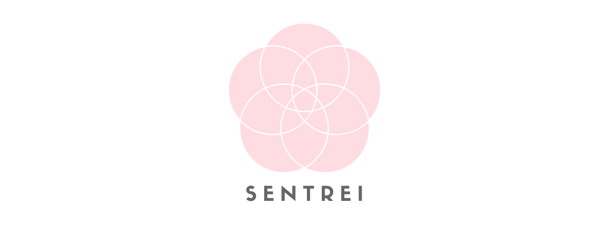

  

<!-- 

    <a></img></a>
    <a></img></a>

 -->

## Getting Started 🚀

### Company 🏢

<!-- prettier-ignore-start -->
| Version | Blog | Design | Pioneer |
| ------- | ---- | ------ | ------- |
| master | https://blog.sentrei.com | https://design.sentrei.com | https://pioneer.sentrei.com |
<!-- prettier-ignore-end -->

### Design 🎨

<!-- prettier-ignore-start -->
| Version | Const | Mobile | Web | UI |
| ------- | ----- | ------ | --- | -- |
| master | [LINK](https://www.figma.com/file/FcE7ACUUJAey0gspwpFN48/const) | [LINK](https://www.figma.com/file/0HJCBXV4H81774BKNzdTPs/mobile) | [LINK](https://www.figma.com/file/jHYqhmFQWXTUO1B0rcChya/web) | https://ui.sentrei.com |
<!-- prettier-ignore-end -->

### Mobile 📱

<!-- prettier-ignore-start -->
| Version | FAD (Android) | FAD (iOS) | Dartdoc |
| ------- | ------------- | --------- | ------- |
| alpha | [LINK](https://appdistribution.firebase.dev/i/ecwjmtsh) | [LINK](https://appdistribution.firebase.dev/i/iCHEpULk) | https://alpha.dartdoc.sentrei.com |
| beta | [LINK](https://appdistribution.firebase.dev/i/zk13ZGu1) | [LINK](https://appdistribution.firebase.dev/i/5rx5sRDi) | https://beta.dartdoc.sentrei.com |
| master | [LINK](https://appdistribution.firebase.dev/i/sXwACykq) | [LINK](https://appdistribution.firebase.dev/i/bNpuzTfZ) | https://master.dartdoc.sentrei.com |
<!-- prettier-ignore-end -->

### Web 🌐

<!-- prettier-ignore-start -->
| Version | Web | Typedoc |
| ------- | --- | ------- |
| alpha | https://alpha.sentrei.com | https://alpha.typedoc.sentrei.com |
| beta | https://beta.sentrei.com | https://beta.typedoc.sentrei.com |
| master | https://master.sentrei.com | https://master.typedoc.sentrei.com |
<!-- prettier-ignore-end -->

## Contributors ✨

Thanks goes to these wonderful people ([emoji key](https://allcontributors.org/docs/en/emoji-key)):

<!-- ALL-CONTRIBUTORS-LIST:START - Do not remove or modify this section -->
<!-- prettier-ignore-start -->
<!-- markdownlint-disable -->
<table>
  <tr>
    <td align="center"><a href="https://www.shunkakinoki.com/"> <b>Shun Kakinoki</b></a> <a href="https://github.com/sentrei/sentrei/commits?author=shunkakinoki" title="Code">💻</a> <a href="#projectManagement-shunkakinoki" title="Project Management">📆</a> <a href="#ideas-shunkakinoki" title="Ideas, Planning, & Feedback">🤔</a> <a href="#business-shunkakinoki" title="Business development">💼</a> <a href="#infra-shunkakinoki" title="Infrastructure (Hosting, Build-Tools, etc)">🚇</a></td>
    <td align="center"><a href="https://imgbot.net"> <b>Imgbot</b></a> <a href="#maintenance-ImgBotApp" title="Maintenance">🚧</a> <a href="#a11y-ImgBotApp" title="Accessibility">️️️️♿️</a> <a href="#design-ImgBotApp" title="Design">🎨</a></td>
  </tr>
</table>

<!-- markdownlint-enable -->
<!-- prettier-ignore-end -->

<!-- ALL-CONTRIBUTORS-LIST:END -->

This project follows the [all-contributors](https://github.com/all-contributors/all-contributors) specification. Contributions of any kind welcome!

## License 📃

## Stargazers over time 📈

## Support 🙋

[Schedule a meeting](https://calendly.com/shunkakinoki) with me for feedback, questions, or support.
We would love to hear your feedback on Sentrei and how we can make it better for you.
Anyone is welcome!
